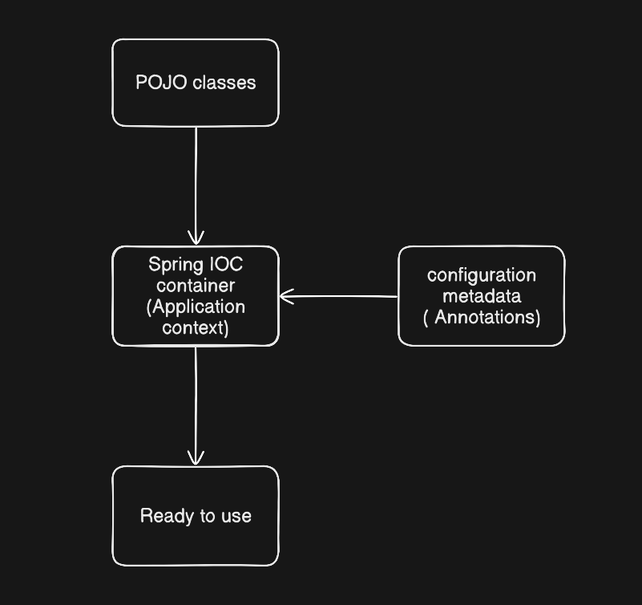
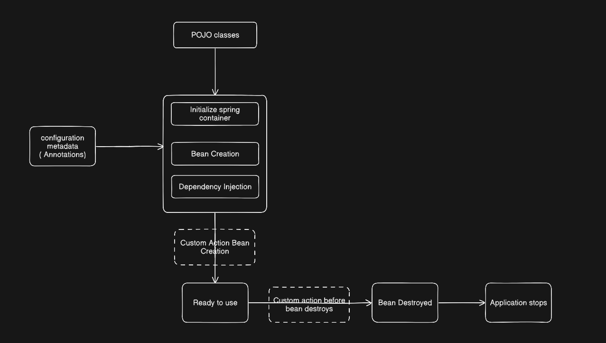

# Bean Life Cycle




In a more detailed way it can be drawn like below:

 

## Customizing  Bean's Nature in  Lifecycle
### `InitializingBean`  Interface
InitializingBean Interface lets the bean to create custom actions after the bean is created in the spring container

It contains a single method named `<u>afterPropertiesSet()</u>` which can be overridden to write custom actions

Example:

```
package com.example;

import org.springframework.beans.factory.InitializingBean;
import org.springframework.beans.factory.annotation.Value;
import org.springframework.stereotype.Component;

@Component
public class CacheConfigManager implements InitializingBean {

    @Value("${app.cache.timeout:300}")
    private int cacheTimeout;

    public CacheConfigManager() {
        System.out.println("[1] Constructor: Timeout value is not yet injected. Value = " + cacheTimeout);
    }

    @Override
    public void afterPropertiesSet() throws Exception {
        System.out.println("[2] afterPropertiesSet: Timeout value injected. Value = " + cacheTimeout);
        
        if (cacheTimeout <= 0) {
            throw new IllegalStateException("Cache timeout must be positive!");
        }
        System.out.println("[3] afterPropertiesSet: Cache system successfully initialized.");
    }
}
```
Output

```
[1] Constructor: Timeout value is not yet injected. Value = 0
[2] afterPropertiesSet: Timeout value injected. Value = 300
[3] afterPropertiesSet: Cache system successfully initialized.
```
### `Disposable`  Interface
Interface that lets a bean release resources like open files or database connections when the container shuts down.

Contains a method called `destroy` , which can be overridden to create custom actions

```
package com.example.demo;

import jakarta.annotation.PreDestroy;
import org.springframework.beans.factory.DisposableBean;
import org.springframework.stereotype.Component;

@Component
public class CacheManagerBean implements DisposableBean {

    public CacheManagerBean() {
        System.out.println("[Bean Lifecycle] 1. CacheManagerBean initialized.");
    }

    // Modern approach: Executes first
    @PreDestroy
    public void preDestroyCleanup() {
        System.out.println("[Bean Lifecycle] 3. @PreDestroy: Flushing data to disk...");
    }

    // Classic interface approach: Executes second
    @Override
    public void destroy() throws Exception {
        System.out.println("[Bean Lifecycle] 4. DisposableBean: Clearing memory cache...");
    }
}
```
```
package com.example.demo;

import org.springframework.boot.CommandLineRunner;
import org.springframework.boot.SpringApplication;
import org.springframework.boot.autoconfigure.SpringBootApplication;
import org.springframework.context.ConfigurableApplicationContext;
import org.springframework.context.annotation.Bean;

@SpringBootApplication
public class DemoApplication {

    public static void main(String[] args) {
        // Capture the context to show a clean program exit
        ConfigurableApplicationContext context = SpringApplication.run(DemoApplication.class, args);
        
        System.out.println("[App] 5. Context closed. Application finished.");
    }

    @Bean
    public CommandLineRunner run() {
        return args -> {
            System.out.println("[App] 2. Application is actively running tasks.");
            // No manual context.close() needed here; Spring Boot cleans up on exit
        };
    }
}
```
> NOTE : `@PostConstruct` and `@PreDestroy` annotations are generally considered best practice for receiving lifecycle callbacks in a modern Spring application. Using these annotations means that your beans are not coupled to Spring-specific interfaces. For details, see [Using @PostConstruct and @PreDestroy](https://docs.spring.io/spring-framework/reference/core/beans/annotation-config/postconstruct-and-predestroy-annotations.html).


