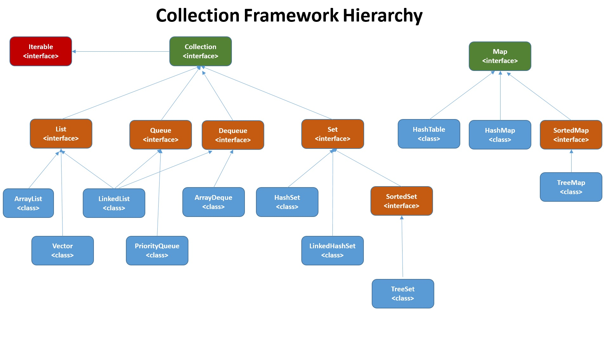

# The Collection Framework



- Super Interface is Collection
- Collections is a class
- Maintain uniformity to access and perform operation on  the elements
- Collection and Map are the main two interfaces in the collection framework

## Auto boxing

Converion of primitive value to its corresponding Wrapper class
```
    ArrayList<Integer> numList = new ArrayList<>();
		System.out.println(numList.size());
		numList.add(new Integer(3));
		numList.add(4);// autoboxing
		numList.add(5);
```


## Traversal

```
    System.out.println("*****************************");
		System.out.println("Enhanced For loop");
		for (Employee emp : empList) {
			System.out.println(emp);
		}

		System.out.println("*****************************");
		System.out.println("Iterator");

		Iterator<Employee> itr = empList.iterator(); // Uni directional
		while (itr.hasNext()) {
			System.out.println(itr.next());
		}

		System.out.println("*****************************");
		System.out.println("Using List iterator - forward direction"); // bi-directional - first we need to go to the
																		// last then only reverse will work

		ListIterator<Employee> litr = empList.listIterator();
		while (litr.hasNext()) {

			System.out.println(litr.next());
		}

		System.out.println("*****************************");
		System.out.println("Using List iterator - backward direction");

		while (litr.hasPrevious()) {

			System.out.println(litr.previous());
		}


```

## comparator example

```

package com.trivium.collections;

import java.util.ArrayList;
import java.util.Comparator;

class EnoAscendingComapartor implements Comparator<Employee>{
	 public int compare(Employee o1, Employee o2) {
		 
		 return o2.getEno() - o1.getEno();
	 }
}

class EnoDescendingComapartor implements Comparator<Employee>{
	 public int compare(Employee o1, Employee o2) {
		 
		 return o1.getEno() - o2.getEno();
	 }
}
class NameAscendingComparator implements Comparator<Employee>{
	
	@Override
	public int compare(Employee o1, Employee o2) {
		// TODO Auto-generated method stub
		return o1.getName().compareTo(o2.getName());
	}
}


class BpAscendingComparator implements Comparator<Employee>{
	@Override
	public int compare(Employee o1, Employee o2) {
		// TODO Auto-generated method stub
		
//		if(o1.getBp() > o2.getBp()) { return 1;}
//		else if(o1.getBp() < o2.getBp()) { return -1;}
//		else { return 0;}
		return Double.compare(o1.getBp(), o2.getBp());
	}
}
public class ArrayListDemo4 {

	public static void main(String[] args) {
		// TODO Auto-generated method stub
	ArrayList<Employee> empList = new ArrayList<>();
		
		empList.add(new Employee(101, "Vrun",12000));
		empList.add(new Employee(102, "Arun",90000));
		empList.add(new Employee(103, "George",40000));
		
		System.out.println("Ascending by eno");
		System.out.println(empList);
		empList.sort(new EnoAscendingComapartor());
		System.out.println(empList);

		
		System.out.println("Descending by eno");
		System.out.println(empList);
		empList.sort(new EnoDescendingComapartor());
		System.out.println(empList);
		
		System.out.println("Ascending by Name");
		System.out.println(empList);
		empList.sort(new NameAscendingComparator());
		System.out.println(empList);

		System.out.println("Ascending by BP");
		System.out.println(empList);
		empList.sort(new BpAscendingComparator());
		System.out.println(empList);
		
		
	}

}

```

# comparable example

```
package com.trivium.collections;

public class Employee implements Comparable<Employee> {
	 
	private int eno;
	private String name;
	private float bp;

	public Employee(int eno, String name, float bp) {
		super();
		this.eno = eno;
		this.name = name;
		this.bp = bp;
	}
	
	
	@Override
	public int hashCode() {
		final int prime = 31;
		int result = 1;
		result = prime * result + Float.floatToIntBits(bp);
		result = prime * result + eno;
		result = prime * result + ((name == null) ? 0 : name.hashCode());
		return result;
	}

	@Override
	public String toString() {
		return "Employee [eno=" + eno + ", name=" + name + ", bp=" + bp + "]";
	}


	@Override
	public boolean equals(Object obj) {
		if (this == obj)
			return true;
		if (obj == null)
			return false;
		if (getClass() != obj.getClass())
			return false;
		Employee other = (Employee) obj;
		if (Float.floatToIntBits(bp) != Float.floatToIntBits(other.bp))
			return false;
		if (eno != other.eno)
			return false;
		if (name == null) {
			if (other.name != null)
				return false;
		} else if (!name.equals(other.name))
			return false;
		return true;
	}
	
	

	 public int getEno() {
		return eno;
	}


	public void setEno(int eno) {
		this.eno = eno;
	}


	public String getName() {
		return name;
	}


	public void setName(String name) {
		this.name = name;
	}


	public float getBp() {
		return bp;
	}


	public void setBp(float bp) {
		this.bp = bp;
	}


//	@Override
//	public int compareTo(Employee o) {
//		// TODO Auto-generated method stub
//		return  o.eno - this.eno;
//	}
	
//	@Override
//	public int compareTo(Employee o) {
//		// TODO Auto-generated method stub
//		return  this.eno - o.eno;
//	}
	
	@Override
	public int compareTo(Employee o) {
		// TODO Auto-generated method stub
		return this.name.compareTo(o.name);
	}
	
}


```